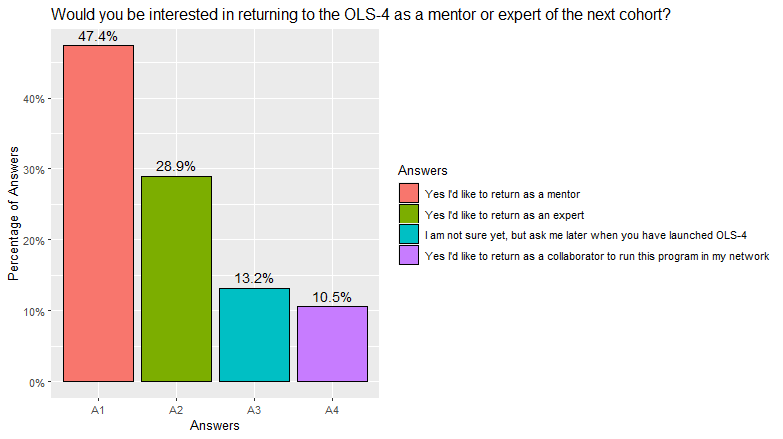
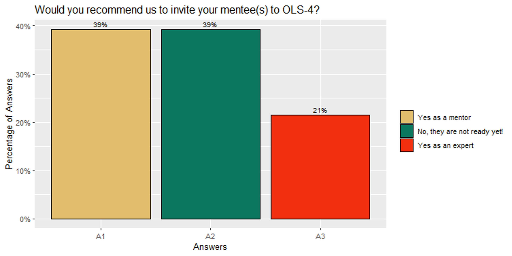

Folder includes only multiple choice questions which are 1,,~~2~~,3,**4**,~~5~~,~~6~~,~~7~~,8,9,~~10~~,~~11~~. (4th one is missing)

**Question 1:** How were your overall mentorship training and support experience in OLS-3? (multiple checks are possible) *(n=28)*

 

**Question 3:** How was your overall experience with the mentoring calls with your mentee? *(n=28)*

 

**Question 8:** Would you be interested in returning to the OLS-4 as a mentor or expert of the next cohort? *(n=28)* 

  

**Question 9:** Would you recommend us to invite your mentee(s) to OLS-4? *(n=28)* 

 
