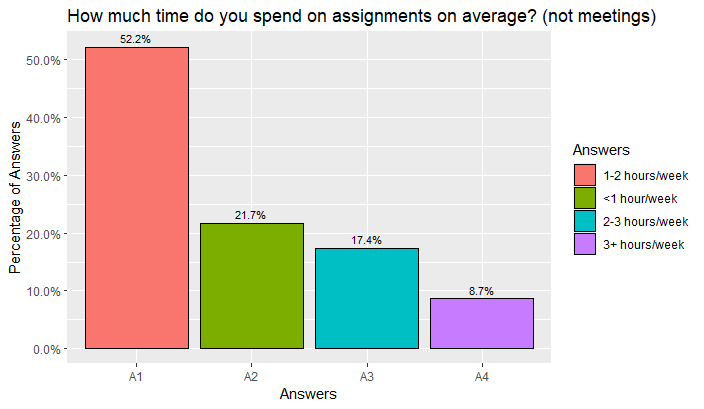

Folder includes only multiple choice questions which are 1,2,~~3~~,4,5,6,7,8,9,~~10~~,11,12,~~13~~,~~14~~

**Question 1:** OLS-3 program is helping me working openly *(n=23)*

 

**Question 2:** OLS-3 is helping me encourage others to work openly *(n=23)*

 

**Question 4:** Which of the following aspects of the cohort call work well? *n=23*)*

 

**Question 5:** What should we improve in cohort calls? *(n=23)*

**Question 6:** Which of the following statements is true regarding the usefulness of the topics introduced at the OLS? *(n=23)*

 

**Question 7:** How much time do you spend on assignments on average? (not meetings) *(n=23)*

 

**Question 8:** Which of the following mode of communication you find most effective?   *(Multiple Selection, *n=23*)*

**Question 9:** How many cohort calls have been able to attend or watch in OLS-3?  *(n=23)*

 

**Question 11:** To what extent did your mentor meet your expectations? *(n=23)*

 

**Question 12:** Would you like to work with your mentor in future? *(n=23)*

 

