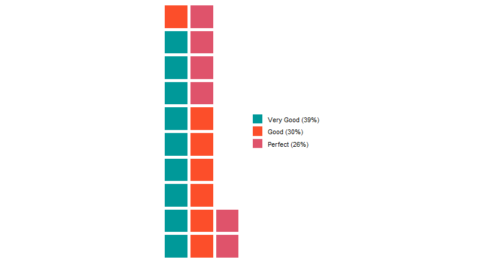

Folder includes only multiple choice questions which are 1,2,~~3~~,4,5,6,7,8,9,~~10~~,~~11~~.

**Question 1:** Through OLS-3, I get opportunities to encourage my mentee(s) and others to work openly *(n=22)*

 

**Question 2:** I have been learning new aspects of working openly through my participation in OLS-3 as a mentor *(n=22)*

 

**Question 4:** Which of the following statements is true regarding the usefulness of the topics for your mentee(s)? *(n=22)*

 

**Question 5:** Which of the following statements is true regarding the completion of the assignments by your mentee(s)? *(n=22)*

 
 

**Question 6:** How much time do you spend on your mentoring role on average? (not meetings) *(n=22)*

 
 

**Question 7:** To what extent did your mentee(s) meet your expectations? *(n=22)*

 
 

**Question 8:** Would you like to work with your mentee(s) in future? *(n=22)*

 

**Question 9:** Which of the following mode of communication you find most effective?  *(n=22)*

 

