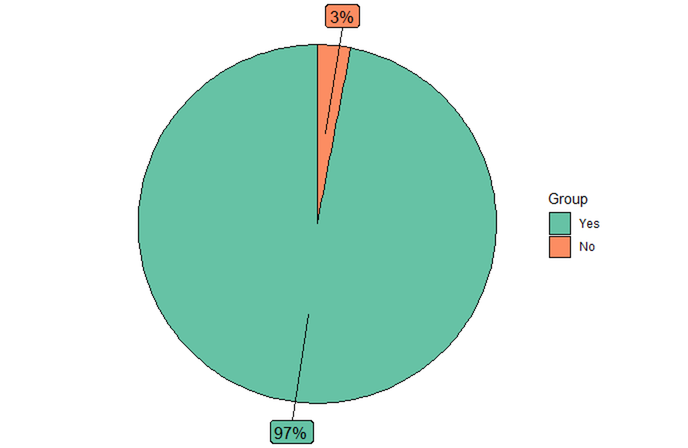

Folder includes only multiple choice questions which are 1,~~2~~,3,~~4~~,5,**6**,~~7~~,8,9,~~10~~  (6th one is missing)

**Question 1:** How was your overall project leadership experience in OLS-3? *(n=35)*

**Question 3:** How was your overall experience with the mentor-mentee calls (this does not include cohort calls)? *(n=35)*

**Question 5:** How was your overall experience with the cohort calls (either when you attended those or watched the recordings on YouTube)? *(n=35)*

 

**Question 8:** Would you be interested in joining the OLS-4 as a mentor or expert of the next cohort? *(n=35)*

 

**Question 9:** Would you recommend this program to others? *(n=35)*

 
